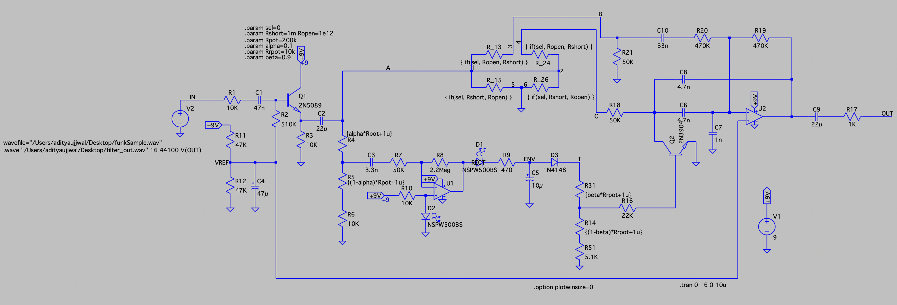
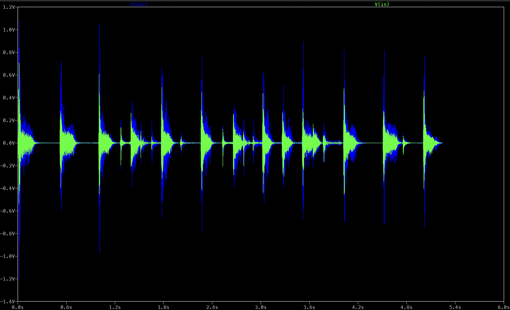

# Envelope Filter (Auto-Wah) LTSpice Simulation

This repository contains the complete circuit design and LTSpice simulation files for an analog envelope filter (auto-wah) guitar pedal. It processes real `.wav` audio files through an analog circuit simulation to demonstrate dynamic, amplitude-responsive frequency modulation.

## 🎧 Audio Simulation Results
You can listen to the actual input and output of the LTSpice transient simulation by clicking the files below (GitHub will open a native audio player):
* 🎸 **[Input Audio: filter_in(Vin).wav](filter_in(Vin).wav)** - The raw, unprocessed guitar track.
* 🎛️ **[Output Audio: filter_out(Vout).wav](filter_out(Vout).wav)** - The simulated output, demonstrating the dynamic filter sweep.

### Transient Output Waveform
*(The visual representation of the filter's dynamic envelope response)*

---

## 🔬 Circuit Architecture Deep Dive

This circuit is broken down into four distinct stages: Input Buffering, Signal Routing (DPDT), Envelope Generation, and Voltage-Controlled Filtering.

### 1. Input Buffer & Preamp Stage
* **Core Component:** Q1 (2N5089 NPN Transistor).
* **Function:** Provides a high input impedance to preserve the guitar's raw signal integrity and prevent "tone sucking." The signal is AC-coupled via `C1` and `C2`, while a voltage divider network (`R11`, `R12`, `C4`) provides a stable VREF bias for the transistor. 

### 2. Virtual DPDT Switch (Signal Routing)
* **Implementation:** LTSpice lacks native mechanical switches, so a virtual DPDT (Double-Pole, Double-Throw) switch was implemented using parametric variables (`.param sel=0`, `Rshort=1m`, `Ropen=1e12`).
* **Function:** The resistor network (`R_13`, `R_24`, `R_15`, `R_26`) dynamically shifts resistance values between 1 milliohm and 1 teraohm based on the `sel` parameter. This elegantly routes the buffered signal (Node A) to the filter stage without needing to manually rewire the schematic between tests.

### 3. Envelope Follower (The "Brain")
* **Core Components:** U1 (Op-Amp), Rectifying Diodes (`D1`, `D2`, `D3`), and Smoothing Capacitor (`C5`).
* **Function:** This stage creates a Control Voltage (CV) that tracks the dynamics of the guitar playing.
    * The audio signal is tapped and fed into `U1` for amplification.
    * Diodes rectify the AC audio signal into a DC voltage.
    * The `10µF` capacitor (`C5`) acts as a low-pass filter/smoother. The charge/discharge rate of this capacitor dictates the "Attack" and "Release" of the wah effect. 
    * The resulting CV is sent to Node `T`.

### 4. Voltage-Controlled Filter (VCF) Stage
* **Core Components:** U2 (Main Filter Op-Amp) and Q2 (2N3904 NPN Transistor).
* **Function:** This is an active filter network where `Q2` acts as a Voltage-Controlled Resistor (VCR). 
    * The CV from the envelope follower drives the base of `Q2`.
    * As the guitar gets louder (harder attack), the CV rises, dropping the collector-emitter resistance of `Q2`.
    * This resistance change dynamically alters the RC time constant of the filter network surrounding `U2`, shifting the cutoff frequency up and down in real-time with the music.

---

## 🛠️ How to Run the Simulation
1. Clone or download this repository.
2. Open `finalEnvelopeFilterPedal_LTspice.asc` in LTSpice.
3. Ensure both `funkSample.wav` and the `.asc` file are in the same directory so the `.wave` directives execute properly.
4. Run the simulation. It will execute a transient analysis (`.tran 0 16 0 10u`) over 16 seconds.
5. The processed audio will automatically be written to `filter_out.wav` in the same directory.
